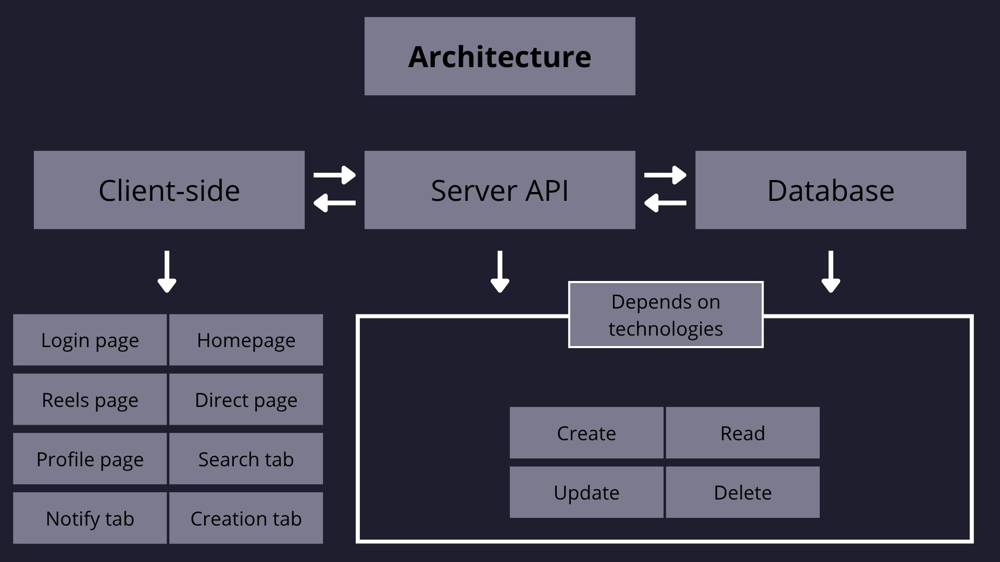

This project is for educational purposes. In each folder, I explain how I implemented the technologies. The goal is to provide a simple working implementation, so I don’t focus on security issues, validations, or preventing exploits. Instead, I aim for a general project structure with a client-side interface for user interaction, a server-side API that acts as a bridge to the database, and a basic CRUD implementation. For better view take a look at the following image:

Also I leave some comentaries of what I find good or bad for each one.

# Instagram clone Implementations Monorepo

## First Implementation

- Frontend (_React_)
- Backend (_Express.js_)
- Database (_MongoDB Atlas_)

### To see further information go into the folder (React Instagram)

## Second Implementation

- Frontend (_Next.js_)
- Backend (_Django / FastAPI_)
- Database (_PostgreSQL_)

### To see further information go into the folder (Next + Django)

